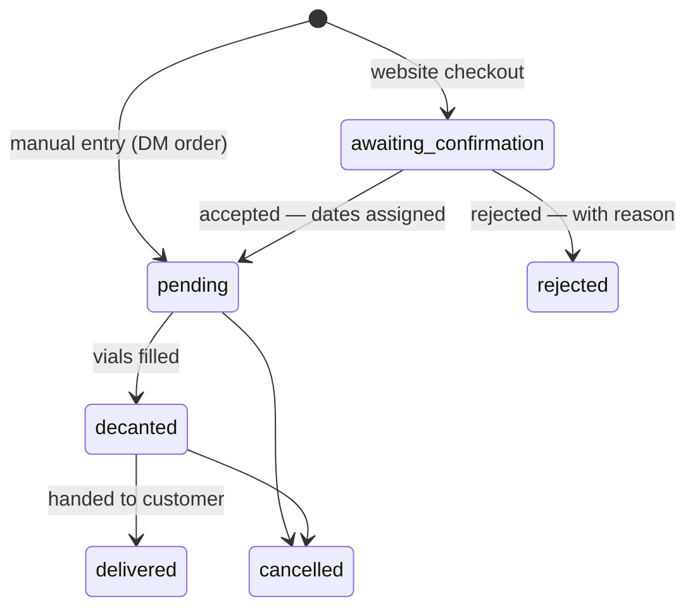

# Decant Please!

**A catalog + ordering system for perfume decanters in Myanmar.**

A decanter buys full bottles (Chanel, Dior, Creed…) and sells them on in 5ml / 10ml / 30ml
vials. That business traditionally lives in TikTok and Facebook DMs — customers message page
after page asking *"do you have X?"* and usually hear *"no."* Decant Please! replaces that with
a browsable storefront and a real guest checkout, while the decanter runs everything from one
admin panel.

No customer accounts. No payment gateway. Payment stays what it already is in Myanmar —
bank transfer, mobile banking, or cash on delivery, confirmed by the decanter.

---

## Repository layout

| Path | What it is |
|---|---|
| `backend/` | Laravel 13 — JSON API + [Filament v5](https://filamentphp.com) admin panel at `/admin` |
| `frontend/` | Next.js 16 (App Router, TypeScript, Tailwind v4) — public storefront |
| `CLAUDE.md` | Project spec and source of truth for every product/design decision |
| `DEPLOY.md` | Production deployment guide (VPS backend + Vercel frontend, backups) |
| `prompts/` | The step-by-step build prompts this project was built from |

## Features

**Storefront (public, no login)**

- Filterable catalog — brand, brand type, gender, size, price range, scent-note and free-text
  search, sorting; all URL-driven, so filtered views are shareable
- Fragrance detail pages with decant sizes/prices, notes, vibes, longevity
- Cart drawer (client-side, survives refresh via `localStorage`)
- Guest checkout — name, phone, address; no card, no account
- Order-complete page with a tracking code, and a tracking page (code + phone) showing a
  status timeline that fills like liquid rising in a vial

**Admin panel (`/admin`, login required)**

- Brand & fragrance CRUD with image upload, per-size pricing and stock toggles
- **Needs review** inbox for website orders — accept (assign decant/delivery dates) or
  reject (with a reason the customer sees when tracking)
- Manual order entry for customers who still order by DM
- **Production schedule** — per-day, aggregated view of which fragrances/sizes to decant
  and how many vials, across all upcoming orders
- Dashboard: monthly revenue, orders by status, decants due today, top fragrances
- CSV export of orders, respecting the current tab/filters/sort
- "View on site" jump from any fragrance row to its public page

## Order lifecycle



Cancelled and rejected orders are excluded from all revenue figures and from the
production schedule.

## Tech stack

| Layer | Choice |
|---|---|
| Backend | Laravel 13 · PHP 8.3+ · MySQL 8 |
| Admin | Filament v5 |
| Frontend | Next.js 16 · React · TypeScript 5 |
| Styling | Tailwind CSS v4 (CSS-first `@theme` tokens) |
| Animation | GSAP (scroll/hero) · Motion (drawers, timeline) |
| Currency | Myanmar Kyat, integer only — `65,000 Ks` |

## Getting started

### Prerequisites

- PHP 8.3+ and Composer
- Node.js 24 LTS
- MySQL 8.0+ — or run it in Docker:

```bash
docker run -d --name decant-mysql \
  -e MYSQL_ROOT_PASSWORD=secret -e MYSQL_DATABASE=decant_please \
  -p 3306:3306 -v decant_mysql_data:/var/lib/mysql mysql:8
```

### 1. Backend — http://localhost:8000

```bash
cd backend
composer install
cp .env.example .env        # set DB_* and ADMIN_PASSWORD
php artisan key:generate
php artisan migrate --seed  # demo catalog + admin user
php artisan serve
```

Admin: **http://localhost:8000/admin** — `admin@decantplease.local` /
whatever `ADMIN_PASSWORD` was when you seeded.

### 2. Frontend — http://localhost:3000

```bash
cd frontend
npm install
cp .env.local.example .env.local
npm run dev
```

## Configuration

**Backend `.env`**

| Variable | Purpose |
|---|---|
| `FRONTEND_URL` | Storefront origin — CORS allowlist **and** admin "View on site" links |
| `ADMIN_PASSWORD` | Read once by the seeder for the admin login |
| `SOCIAL_TIKTOK_URL` / `SOCIAL_FACEBOOK_URL` | Shown as storefront footer links; blank = hidden |

**Frontend `.env.local`**

| Variable | Purpose |
|---|---|
| `NEXT_PUBLIC_API_URL` | Laravel API base, e.g. `http://localhost:8000/api` |
| `NEXT_PUBLIC_SITE_URL` | Public site URL — canonical/OG metadata |

## Public API

All endpoints are under `/api/v1`, JSON, paginated where applicable.

| Method | Endpoint | Purpose | Throttle |
|---|---|---|---|
| GET | `/fragrances` | Filterable catalog | 120/min |
| GET | `/fragrances/{slug}` | Fragrance detail | 120/min |
| GET | `/brands` | Active brands | 120/min |
| GET | `/meta` | Filter options, price bounds, social links | 120/min |
| POST | `/orders` | Guest checkout | 10/min |
| GET | `/orders/track` | Status by tracking code + phone | 20/min |

Guarantees worth knowing:

- **Prices are never trusted from the client.** Checkout receives only
  `fragrance_id`, `size_ml`, `quantity`; the server re-derives every price from the current
  catalog and stores immutable snapshots on the order items.
- **Tracking is not a guessing oracle.** Lookup requires an exact code + phone match;
  a mismatch on either returns the same generic 404.
- Checkout carries a honeypot field; bots get a convincing fake response and nothing is stored.

## Route map

The API routes are the table above. Everything else the two apps serve:

**Storefront (Next.js)**

| Route | Rendering | What it is |
|---|---|---|
| `/` | static, 60s revalidate | Home — hero, featured rail, how-it-works, category tiles |
| `/shop` | dynamic | Filterable catalog; all filter state lives in the URL query string |
| `/fragrance/{slug}` | dynamic | Fragrance detail + size selector + add to cart (404s on unknown/inactive slugs) |
| `/checkout` | static shell | Cart summary + contact form (cart itself is client-side) |
| `/order/complete?code=…` | dynamic | Tracking code + order summary, survives refresh via the URL |
| `/track` | dynamic | Tracking code + phone → status timeline |
| `/robots.txt`, `/icon.svg` | static | SEO rules (checkout/order pages disallowed) and favicon |

**Admin panel (Filament — everything below requires login)**

| Route | What it is |
|---|---|
| `/admin/login` | The only public admin route |
| `/admin` | Dashboard — stats, revenue chart, top fragrances, upcoming decants |
| `/admin/brands` + `/create`, `/{id}/edit` | Brand CRUD |
| `/admin/fragrances` + `/create`, `/{id}/edit` | Fragrance CRUD, prices, stock, "View on site" |
| `/admin/orders` + `/create`, `/{id}/edit` | Order tabs (Needs review first), accept/reject, CSV export |
| `/admin/production-schedule` | Aggregated daily decant schedule |

**Backend utility routes (deployment-relevant)**

| Route | What it is |
|---|---|
| `/up` | Laravel health check — point uptime monitors / load-balancer probes here |
| `/storage/{path}` | Uploaded images — requires `php artisan storage:link` on every deploy target |
| `/` | Plain Laravel welcome page; the real storefront lives on the frontend host |

## Project structure

Trimmed to the files you'd look for first. Deployment-relevant paths are marked `←`.

**Backend (`backend/`)**

```text
backend/
├── app/
│   ├── Console/Commands/FreshStart.php     # php artisan decant:fresh-start (handover wipe)
│   ├── Enums/                              # BrandType, Concentration, Gender, OrderSource, OrderStatus
│   ├── Filament/
│   │   ├── Pages/ProductionSchedule.php    # /admin/production-schedule (+ its Blade view)
│   │   ├── Resources/                      # Brands/, Fragrances/, Orders/ — each: Resource + Schemas/ (form) + Tables/ + Pages/
│   │   └── Widgets/                        # OrderStats, RevenueChart, TopFragrances, UpcomingDecants
│   ├── Http/
│   │   ├── Controllers/Api/                # Brand, Fragrance, Meta, Order (checkout), TrackOrder
│   │   └── Resources/                      # JSON shaping for brands, fragrances, prices
│   ├── Models/                             # Brand, Fragrance, DecantPrice, Order, OrderItem (+ Concerns/HasSlug)
│   │                                       #   Order owns the domain rules: tracking codes, newFromCheckout, accept/reject
│   ├── Providers/
│   │   ├── AppServiceProvider.php          # forces HTTPS in production, N+1 guard outside production
│   │   └── Filament/AdminPanelProvider.php # /admin panel definition (auth, branding, nav groups)
│   └── Support/Money.php                   # the one Kyat formatter — all money display goes through it
├── bootstrap/app.php                       # routing + middleware wiring (api: routes/api.php)
├── config/cors.php                         # allowlist = FRONTEND_URL           ← must match storefront origin
├── database/
│   ├── migrations/                         # brands, fragrances, decant_prices, orders, order_items
│   └── seeders/                            # admin user (ADMIN_PASSWORD) + demo catalog + demo orders
├── public/                                 # ← web root — point Nginx/PHP-FPM here, never at the repo root
├── routes/api.php                          # /api/v1/* with per-endpoint throttles
├── storage/                                # ← must be writable (www-data); app/public = uploaded images (back this up)
├── tests/Feature/                          # 39 tests: domain, admin catalog, admin orders, public API, fresh-start
├── .env.example                            # ← template for the production .env (see DEPLOY.md)
└── composer.json                           # PHP 8.3+, Laravel 13, Filament v5
```

**Frontend (`frontend/`)**

```text
frontend/
├── src/
│   ├── app/                                # ← routes: one folder per URL (App Router)
│   │   ├── layout.tsx                      # nav + footer + cart drawer + OG defaults (NEXT_PUBLIC_SITE_URL)
│   │   ├── globals.css                     # ← the whole design system: Tailwind v4 @theme tokens (mist/pine/…)
│   │   ├── page.tsx                        # /
│   │   ├── shop/page.tsx                   # /shop (+ loading.tsx skeleton)
│   │   ├── fragrance/[slug]/page.tsx       # /fragrance/:slug
│   │   ├── checkout/page.tsx               # /checkout
│   │   ├── order/complete/page.tsx         # /order/complete
│   │   ├── track/page.tsx                  # /track
│   │   ├── robots.ts · icon.svg            # /robots.txt, favicon
│   │   └── error.tsx · not-found.tsx       # branded error/404 pages
│   ├── components/
│   │   ├── ui/                             # primitives: Pill, Button, ImagePlate, QuantityStepper, Skeleton
│   │   ├── layout/                         # Navbar, Footer (social links from /meta), MobileNav, CartButton
│   │   ├── catalog/                        # FragranceCard/Grid, filter bar/sheet/controls, Pagination
│   │   ├── product/                        # SizeSelector, PurchasePanel (add to cart)
│   │   ├── cart/                           # CartDrawer, CartItemRow
│   │   ├── checkout/                       # CheckoutForm/Client, OrderSummaryCard, OrderCompleteClient
│   │   ├── tracking/                       # TrackingForm, TrackClient, StatusTimeline (the vial fill)
│   │   └── home/                           # Hero (GSAP), ScrollReveal, FeaturedRail
│   ├── lib/
│   │   ├── api.ts                          # ← every call to the Laravel API; base URL = NEXT_PUBLIC_API_URL
│   │   ├── cart-context.tsx                # client-side cart (localStorage), drawer state
│   │   ├── types.ts                        # TypeScript mirrors of the API resources
│   │   └── format.ts                       # formatKyat
│   └── hooks/useCart.ts
├── next.config.ts                          # ← allowed image hosts follow NEXT_PUBLIC_API_URL automatically
├── .env.local.example                      # ← template: NEXT_PUBLIC_API_URL, NEXT_PUBLIC_SITE_URL
└── package.json                            # Node 24 LTS, Next.js 16, Tailwind v4, GSAP, Motion
```

Build artifacts (`frontend/.next/`, `backend/vendor/`, `node_modules/`) and secrets
(`backend/.env`, `frontend/.env.local`) are git-ignored — deploys recreate them with
`composer install` / `npm run build` and the env templates above.

## Testing

```bash
cd backend && php artisan test   # 39 tests — domain, admin (Livewire), full API
cd frontend && npm run build     # type-checks and builds the storefront
```

Tests run on an in-memory SQLite database and never touch your dev data.
N+1 queries throw in dev/test (`Model::preventLazyLoading`), silently allowed in production.

## Deployment

See **[DEPLOY.md](DEPLOY.md)** — exact commands for a PHP-FPM + Nginx + MySQL VPS,
Vercel setup for the frontend, the production `.env` template, and the nightly
`mysqldump` backup cron (order history is the decanter's financial record).

When the demo data has served its purpose:

```bash
php artisan decant:fresh-start   # wipes demo fragrances + orders; keeps brands and the admin login
```

## Design

Premium-minimalist, apothecary-adjacent — pale `mist` background, near-black text, deep
`pine` green used sparingly, one Helvetica-stack family throughout. Every piece of metadata
lives in a thin hairline-bordered pill (a vial label, not a badge), and the one deliberate
motion moment is the tracking timeline filling like a vial. Tokens live in
`frontend/src/app/globals.css`; the full design language is specified in `CLAUDE.md`.

## Deliberately out of scope

Online payments, customer accounts, chat, multi-decanter marketplace, bottle-volume
inventory, email/SMS notifications. See `CLAUDE.md` §8 before adding any of these.
