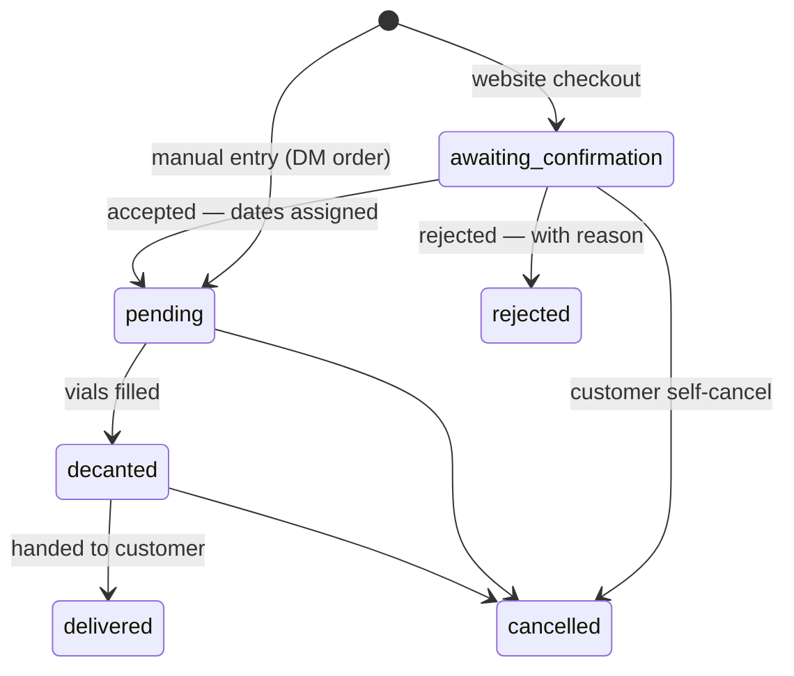

# Decant Please!

**A catalog + ordering system for perfume decanters in Myanmar.**

A decanter buys full bottles (Chanel, Dior, Creed…) and sells them on in 5ml / 10ml / 30ml
vials. That business traditionally lives in TikTok and Facebook DMs — customers message page
after page asking *"do you have X?"* and usually hear *"no."* Decant Please! replaces that with
a browsable storefront and a real guest checkout, while the decanter runs everything from one
admin panel.

No customer accounts. No payment gateway. Payment stays what it already is in Myanmar —
bank transfer, mobile banking, or cash on delivery, confirmed by the decanter.

---

## Repository layout

| Path | What it is |
|---|---|
| `backend/` | Laravel 13 — JSON API + [Filament v5](https://filamentphp.com) admin panel at `/admin` — [README](backend/README.md) with routes & file structure |
| `frontend/` | Next.js 16 (App Router, TypeScript, Tailwind v4) — public storefront — [README](frontend/README.md) with routes & file structure |
| `CLAUDE.md` | Project spec and source of truth for every product/design decision |
| `DEPLOY.md` | Production deployment guide (VPS backend + Vercel frontend, backups) |
| `prompts/` | The step-by-step build prompts this project was built from |

## Features

**Storefront (public, no login)**

- Filterable catalog — brand, brand type, gender, size, price range, scent-note and free-text
  search, sorting; all URL-driven, so filtered views are shareable
- Fragrance detail pages with decant sizes/prices, notes, vibes, longevity
- Cart drawer (client-side, survives refresh via `localStorage`)
- Guest checkout — name, phone, address; no card, no account
- Order-complete and tracking pages sharing one full receipt — order number, customer +
  shipping details, itemized pricing, a status timeline that fills like liquid rising in
  a vial, and a print / save-as-PDF view
- Customer self-cancellation while an order is still awaiting confirmation
- Promo codes at checkout — live preview before committing, re-validated atomically at
  submission, named on the receipt
- Related fragrances on every detail page, a recently-viewed rail, and a generated sitemap

**Admin panel (`/admin`, login required)**

- Brand & fragrance CRUD with image upload, per-size pricing and stock toggles
- **Needs review** inbox for website orders — accept (assign decant/delivery dates) or
  reject (with a reason the customer sees when tracking)
- Manual order entry for customers who still order by DM
- **Production schedule** — per-day, aggregated view of which fragrances/sizes to decant
  and how many vials, across all upcoming orders
- Promo code management — percent or fixed codes with caps, minimums, usage limits and dates
- Dashboard: monthly revenue, orders by status, decants due today, top fragrances
- CSV export of orders, respecting the current tab/filters/sort
- "View on site" jump from any fragrance row to its public page

## Order lifecycle



Cancelled and rejected orders are excluded from all revenue figures and from the
production schedule.

## Tech stack

| Layer | Choice |
|---|---|
| Backend | Laravel 13 · PHP 8.3+ · MySQL 8 |
| Admin | Filament v5 |
| Frontend | Next.js 16 · React · TypeScript 5 |
| Styling | Tailwind CSS v4 (CSS-first `@theme` tokens) |
| Animation | GSAP (scroll/hero) · Motion (drawers, timeline) |
| Currency | Myanmar Kyat, integer only — `65,000 Ks` |

## Getting started

### Prerequisites

**Docker** (with Compose). That's it — PHP, Composer, Node, and MySQL all run inside
the containers, so nobody needs the right local versions of anything. Prefer running
the toolchains natively? See [Running without Docker](#running-without-docker).

### Run the whole stack

```bash
docker compose up   # MySQL + API on :8010 + storefront on :3001
```

The first run bootstraps everything unattended (give it a few minutes to install
dependencies):

- creates `backend/.env` and `frontend/.env.local` from their committed examples
- `composer install` + `npm install` — into the bind-mounted repo, so your editor
  sees `vendor/` and `node_modules/`, and both apps hot-reload as usual
- generates `APP_KEY`, links `storage/`, waits for MySQL, runs migrations
- on an empty database, seeds the demo catalog and the admin user — a blank
  `ADMIN_PASSWORD` gets a generated one, saved to `backend/.env`

Then:

| URL | What |
|---|---|
| http://localhost:3001 | Storefront |
| http://localhost:8010/admin | Admin — `admin@decantplease.local` / the `ADMIN_PASSWORD` line in `backend/.env` |

Ports are 8010/3001 because 8000/3000/3010 are taken by other local projects. The
database lives in the `decant_mysql_data` volume: it survives `docker compose down`,
and `down -v` wipes it so the next `up` migrates and seeds from scratch. If you still
have the standalone `decant-mysql` container from an earlier version of this README,
stop/remove it first — the compose `mysql` service reuses its volume, so existing
data carries over.

An existing `backend/.env` is read as-is, with one exception: the `DB_*` connection
is pinned to the compose `mysql` service, so the same file keeps working whether the
stack runs in Docker or against a host MySQL.

### Running without Docker

Prerequisites: PHP 8.3+ and Composer, Node.js 24 LTS, and MySQL 8.0+ — or run just
the database in Docker:

```bash
docker run -d --name decant-mysql \
  -e MYSQL_ROOT_PASSWORD=secret -e MYSQL_DATABASE=decant_please \
  -p 3306:3306 -v decant_mysql_data:/var/lib/mysql mysql:8
```

**Backend — http://localhost:8010**

```bash
cd backend
composer install
cp .env.example .env        # set DB_* and ADMIN_PASSWORD
php artisan key:generate
php artisan migrate --seed  # demo catalog + admin user
php artisan storage:link    # serve uploaded images from /storage
php artisan serve --port=8010
```

Admin: **http://localhost:8010/admin** — `admin@decantplease.local` /
whatever `ADMIN_PASSWORD` was when you seeded.

**Frontend — http://localhost:3001**

```bash
cd frontend
npm install
cp .env.local.example .env.local
npm run dev -- -p 3001
```

## Configuration

**Backend `.env`**

| Variable | Purpose |
|---|---|
| `FRONTEND_URL` | Storefront origin — CORS allowlist **and** admin "View on site" links |
| `ADMIN_PASSWORD` | Read once by the seeder for the admin login |
| `SOCIAL_TIKTOK_URL` / `SOCIAL_FACEBOOK_URL` | Shown as storefront footer links; blank = hidden |

**Frontend `.env.local`**

| Variable | Purpose |
|---|---|
| `NEXT_PUBLIC_API_URL` | Laravel API base, e.g. `http://localhost:8010/api` |
| `NEXT_PUBLIC_SITE_URL` | Public site URL — canonical/OG metadata |

## Public API

All endpoints are under `/api/v1`, JSON, paginated where applicable.

| Method | Endpoint | Purpose | Throttle |
|---|---|---|---|
| GET | `/fragrances` | Filterable catalog | 120/min |
| GET | `/fragrances/{slug}` | Fragrance detail | 120/min |
| GET | `/brands` | Active brands | 120/min |
| GET | `/meta` | Filter options, price bounds, social links | 120/min |
| POST | `/orders` | Guest checkout | 10/min |
| GET | `/orders/track` | Full receipt by tracking code + phone | 20/min |
| POST | `/orders/cancel` | Customer cancel while awaiting confirmation | 10/min |
| POST | `/orders/validate-promo` | Preview a promo code against the cart | 10/min |

Guarantees worth knowing:

- **Prices are never trusted from the client.** Checkout receives only
  `fragrance_id`, `size_ml`, `quantity`; the server re-derives every price from the current
  catalog and stores immutable snapshots on the order items.
- **Tracking is not a guessing oracle.** Lookup requires an exact code + phone match;
  a mismatch on either returns the same generic 404.
- Checkout carries a honeypot field; bots get a convincing fake response and nothing is stored.

## Testing

Inside the Docker stack (no local toolchains needed):

```bash
docker compose exec backend php artisan test   # 47 tests — domain, admin (Livewire), full API
docker compose exec frontend npm run build     # type-checks and builds the storefront
```

Or with local toolchains:

```bash
cd backend && php artisan test   # 47 tests — domain, admin (Livewire), full API
cd frontend && npm run build     # type-checks and builds the storefront
```

Tests run on an in-memory SQLite database and never touch your dev data.
N+1 queries throw in dev/test (`Model::preventLazyLoading`), silently allowed in production.

## Deployment

See **[DEPLOY.md](DEPLOY.md)** — exact commands for a PHP-FPM + Nginx + MySQL VPS,
Vercel setup for the frontend, the production `.env` template, and the nightly
`mysqldump` backup cron (order history is the decanter's financial record).

When the demo data has served its purpose:

```bash
php artisan decant:fresh-start   # wipes demo fragrances + orders; keeps brands and the admin login
```

## Design

Premium-minimalist, apothecary-adjacent — pale `mist` background, near-black text, deep
`pine` green used sparingly, one Helvetica-stack family throughout. Every piece of metadata
lives in a thin hairline-bordered pill (a vial label, not a badge), and the one deliberate
motion moment is the tracking timeline filling like a vial. Tokens live in
`frontend/src/app/globals.css`; the full design language is specified in `CLAUDE.md`.

## Deliberately out of scope

Online payments, customer accounts, chat, multi-decanter marketplace, bottle-volume
inventory, email/SMS notifications. See `CLAUDE.md` §8 before adding any of these.
