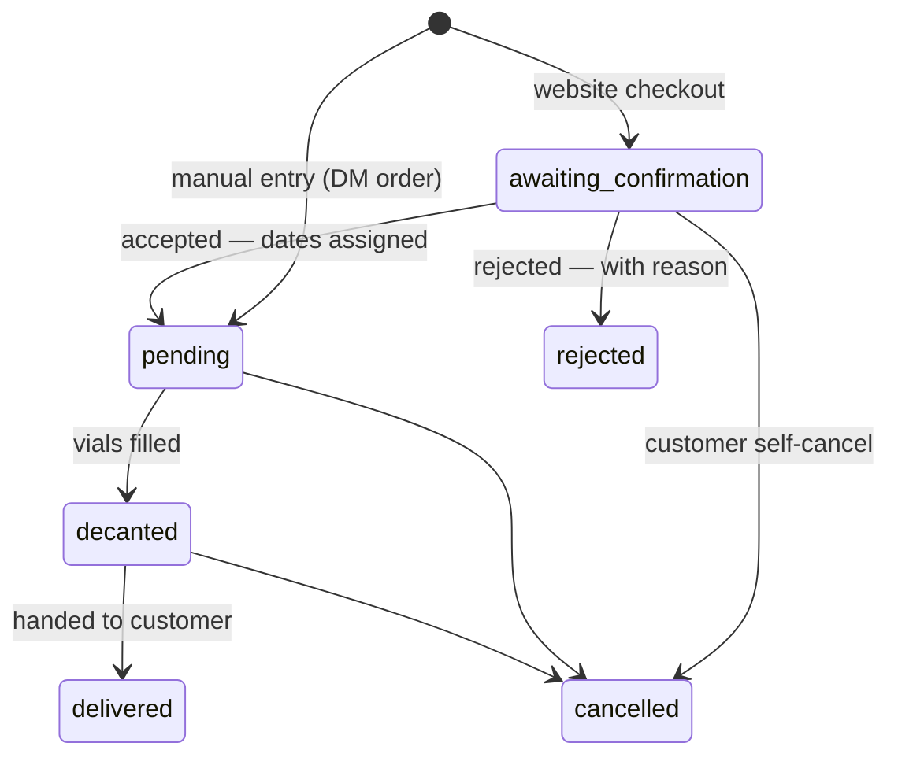

# Decant Please!

**A catalog + ordering system for perfume decanters in Myanmar.**

A decanter buys full bottles (Chanel, Dior, Creed…) and sells them on in 5ml / 10ml / 30ml
vials. That business traditionally lives in TikTok and Facebook DMs — customers message page
after page asking *"do you have X?"* and usually hear *"no."* Decant Please! replaces that with
a browsable storefront and a real guest checkout, while the decanter runs everything from one
admin panel.

No customer accounts. No payment gateway. Payment stays what it already is in Myanmar —
bank transfer, mobile banking, or cash on delivery, confirmed by the decanter.

---

## Repository layout

| Path | What it is |
|---|---|
| `backend/` | Laravel 13 — JSON API + [Filament v5](https://filamentphp.com) admin panel at `/admin` — [README](backend/README.md) with routes & file structure |
| `frontend/` | Next.js 16 (App Router, TypeScript, Tailwind v4) — public storefront — [README](frontend/README.md) with routes & file structure |
| `CLAUDE.md` | Project spec and source of truth for every product/design decision |
| `FINANCE.md` | Financial-surface roadmap — what's built, the real gaps in build order, and the money decisions locked or still open |
| `DEPLOY.md` | Production deployment guide (Heroku backend + Vercel frontend + Cloudflare R2 storage, backups) |
| `prompts/` | The step-by-step build prompts this project was built from |
| `prompts/WORKFLOW.md` | The issue → branch → PR loop every step follows — PRs always wait for human review; `main` changes only via the promotion PR |

## Features

**Storefront (public, no login)**

- Filterable catalog — brand, brand type, gender, size, price range, scent-note and free-text
  search, sorting; all URL-driven, so filtered views are shareable
- Fragrance detail pages with decant sizes/prices, notes, vibes, longevity
- Cart drawer (client-side, survives refresh via `localStorage`)
- Guest checkout — name, phone, address; no card, no account
- Order-complete and tracking pages sharing one full receipt — order number, customer +
  shipping details, itemized pricing, a status timeline that fills like liquid rising in
  a vial, and a print / save-as-PDF view
- Customer self-cancellation while an order is still awaiting confirmation
- Promo codes at checkout — live preview before committing, re-validated atomically at
  submission, named on the receipt
- Offline-payment panel on the receipt — balance due, the decanter's configured
  KBZPay/Wave transfer details and optional QR, and a transfer-screenshot upload;
  flips to "paid" once the decanter confirms (no gateway — see below)
- Related fragrances on every detail page, a recently-viewed rail, and a generated sitemap
- Structured delivery address at checkout — region → township selects with the delivery
  fee derived from the township server-side (shown as its own line, paid in cash to the
  courier; never part of an online prepayment)

**Admin panel (`/admin`, login required)**

- Brand & fragrance CRUD with image upload, per-size pricing, stock toggles, and a
  liquid-only bottle-cost reference (admin-eyes only — never the public API or invoices)
- **Needs review** inbox for website orders — accept (assign decant/delivery dates) or
  reject (with a reason the customer sees when tracking)
- Manual order entry for customers who still order by DM
- **Production schedule** — per-day, aggregated view of which fragrances/sizes to decant
  and how many vials, across all upcoming orders
- Payment tracking — mark orders paid/unpaid (confirmation time auto-stamped), payment
  badge + filter, the customer's transfer screenshot attached to the order (stored in a
  private bucket, served only through an authenticated admin route)
- Decant stock by total ml — opt-in per fragrance, drawn down automatically when an
  order is decanted; warn-only (a shortfall never blocks an order)
- Bulk catalog CSV import — the decanter's existing price list, one row per fragrance;
  idempotent re-uploads, opt-in update mode, failed rows returned as a fixable CSV,
  downloadable template
- Telegram alert to the decanter's phone the moment a website order lands (off until a
  bot token + chat id are configured; a Telegram outage never delays checkout)
- Promo code management — percent or fixed codes with caps, minimums, usage limits and dates
- Delivery zones (Settings) — a township rate table seeded from Royal Express's coverage
  chart, with per-courier coverage/reference costs (admin-eyes only), bulk fee/cost
  pricing, CSV import, and a courier choice recorded at Accept
- Expenses & monthly P&L (Finance menu) — category'd expense entry in seconds, and a
  Profit & loss page: income from order snapshots, liquid COGS with coverage, expenses
  as entered, a delivery result line, and an honestly-labelled net; stock purchases sit
  below the line (inventory — they become COGS as poured)
- Dashboard: monthly revenue, a "Gross margin (liquid only)" stat (fully-costed
  orders only — vial/label/spillage and delivery excluded, coverage named), discount
  cost by code, cash with couriers (COD float — snapshotted at handoff), orders by
  status, unpaid orders + outstanding total, decants due today, top fragrances, and a
  low-stock reorder panel
- CSV export of orders, respecting the current tab/filters/sort (incl. payment,
  balance-due, and liquid-only cost/margin columns — blank when unknown, never 0)
- Printable A5 packing invoices (PDF) — print or download per order, or one batch PDF for
  the filtered view (e.g. today's deliveries), with an emphasized balance-due figure and a
  bundled Myanmar-script font so Burmese names/addresses render
- "View on site" jump from any fragrance row to its public page

## Order lifecycle


```mermaid
stateDiagram-v2
    [*] --> awaiting_confirmation: website checkout
    [*] --> pending: manual entry (DM order)
    awaiting_confirmation --> pending: accepted — dates assigned
    awaiting_confirmation --> rejected: rejected — with reason
    awaiting_confirmation --> cancelled: customer self-cancel
    pending --> decanted: vials filled
    decanted --> delivered: handed to customer
    pending --> cancelled
    decanted --> cancelled
```

Cancelled and rejected orders are excluded from all revenue figures and from the
production schedule.

## Tech stack

| Layer | Choice |
|---|---|
| Backend | Laravel 13 · PHP 8.3+ · PostgreSQL 17 |
| Admin | Filament v5 |
| Frontend | Next.js 16 · React · TypeScript 5 |
| Styling | Tailwind CSS v4 (CSS-first `@theme` tokens) |
| Animation | GSAP (scroll/hero) · Motion (drawers, timeline) |
| Currency | Myanmar Kyat, integer only — `65,000 Ks` |

## Getting started

### Prerequisites

**Docker** (with Compose). That's it — PHP, Composer, Node, and PostgreSQL all run inside
the containers, so nobody needs the right local versions of anything. Prefer running
the toolchains natively? See [Running without Docker](#running-without-docker).

### Run the whole stack

```bash
docker compose up   # PostgreSQL + API on :8010 + storefront on :3001
```

The first run bootstraps everything unattended (give it a few minutes to install
dependencies):

- creates `backend/.env` and `frontend/.env.local` from their committed examples
- `composer install` + `npm install` — into the bind-mounted repo, so your editor
  sees `vendor/` and `node_modules/`, and both apps hot-reload as usual
- generates `APP_KEY`, links `storage/`, waits for PostgreSQL, runs migrations
- on an empty database, seeds the demo catalog and the admin user — a blank
  `ADMIN_PASSWORD` gets a generated one, saved to `backend/.env`

Then:

| URL | What |
|---|---|
| http://localhost:3001 | Storefront |
| http://localhost:8010/admin | Admin — `admin@decantplease.local` / the `ADMIN_PASSWORD` line in `backend/.env` |

Ports are 8010/3001 because 8000/3000/3010 are taken by other local projects; Postgres
publishes 5442 for the same reason. The database lives in the `decant_postgres_data`
volume: it survives `docker compose down`, and `down -v` wipes it so the next `up`
migrates and seeds from scratch. If you have the standalone `decant-postgres` container
from [Running without Docker](#running-without-docker) below, stop it first — it holds
the same port.

An existing `backend/.env` is read as-is, with one exception: the `DB_*` connection
is pinned to the compose `postgres` service, so the same file keeps working whether the
stack runs in Docker or against a host PostgreSQL.

#### Coming from the MySQL stack?

This project ran on MySQL through v5. Nothing migrates automatically — Postgres can't
read MySQL's files, so **your local dev data does not carry over** and the next `up`
seeds a fresh demo catalog. Nothing is deleted: the old `decant_mysql_data` volume is
left untouched, so anything you need is still recoverable. Two things to do once:

```bash
docker compose down --remove-orphans   # else the old decant-please-mysql-1 lingers on 3306
docker compose up --build              # a plain `up` won't rebuild for pdo_pgsql
```

Uploaded images live in `backend/storage/`, not the database, so they survive — but the
fragrance rows that referenced them don't, so you'll be re-uploading.

Everything in the containers runs as root, so the same compose file works whether your
checkout lives in your home directory or somewhere root-owned like `/var/www`. The
`.env` files are handed back to whoever owns the checkout; `vendor/` and `node_modules/`
stay root-owned, which matters only if you delete them by hand. Ran an older version of
this stack? `docker compose up --build` once — a plain `up` reuses your existing image
and won't pick up changes to `backend/Dockerfile`.

### Running without Docker

Prerequisites: PHP 8.3+ and Composer (with `pdo_pgsql`), Node.js 24 LTS, and
PostgreSQL 17 — or run just the database in Docker:

```bash
docker run -d --name decant-postgres \
  -e POSTGRES_PASSWORD=secret -e POSTGRES_DB=decant_please -e POSTGRES_USER=postgres \
  -p 5442:5432 -v decant_postgres_data:/var/lib/postgresql/data postgres:17
```

That publishes 5442, matching `backend/.env.example`'s `DB_PORT` — 5432 is already
taken on this dev machine. Running a native PostgreSQL on the default port instead?
Set `DB_PORT=5432`.

**Backend — http://localhost:8010**

```bash
cd backend
composer install
cp .env.example .env        # set DB_* and ADMIN_PASSWORD
php artisan key:generate
php artisan migrate --seed  # demo catalog + admin user
php artisan storage:link    # serve uploaded images from /storage
php artisan serve --port=8010
```

Admin: **http://localhost:8010/admin** — `admin@decantplease.local` /
whatever `ADMIN_PASSWORD` was when you seeded.

**Frontend — http://localhost:3001**

```bash
cd frontend
npm install
cp .env.local.example .env.local
npm run dev -- -p 3001
```

## Configuration

**Backend `.env`**

| Variable | Purpose |
|---|---|
| `FRONTEND_URL` | Storefront origin — CORS allowlist **and** admin "View on site" links |
| `ADMIN_PASSWORD` | Read once by the seeder for the admin login |
| `SOCIAL_TIKTOK_URL` / `SOCIAL_FACEBOOK_URL` | Shown as storefront footer links; blank = hidden |
| `PAYMENT_KBZPAY_*` / `PAYMENT_WAVE_*` / `PAYMENT_QR_URL` / `PAYMENT_INSTRUCTIONS` | Offline transfer details shown at checkout / on the receipt via `/api/v1/meta`; blank fields are hidden |
| `TELEGRAM_BOT_TOKEN` / `TELEGRAM_ADMIN_CHAT_ID` | New-order alerts to the decanter's Telegram; both blank = alerts off |
| `MEDIA_DISK` | Disk for uploaded images — `public` locally (via `storage:link`), `s3` (Cloudflare R2) in production |
| `PROOFS_DISK` (+ `PROOFS_AWS_*`) | **Private** disk for payment-proof screenshots — `local` (`storage/app/private`) by default, a second no-public-domain R2 bucket in production |

**Frontend `.env.local`**

| Variable | Purpose |
|---|---|
| `NEXT_PUBLIC_API_URL` | Laravel API base, e.g. `http://localhost:8010/api` |
| `NEXT_PUBLIC_SITE_URL` | Public site URL — canonical/OG metadata |
| `NEXT_PUBLIC_IMAGE_URL` | Production only — the R2 public image host, allow-listed for the image optimizer; unset locally |

## Public API

All endpoints are under `/api/v1`, JSON, paginated where applicable.

| Method | Endpoint | Purpose | Throttle |
|---|---|---|---|
| GET | `/fragrances` | Filterable catalog | 120/min |
| GET | `/fragrances/{slug}` | Fragrance detail | 120/min |
| GET | `/brands` | Active brands | 120/min |
| GET | `/meta` | Filter options, price bounds, social links, payment details | 120/min |
| GET | `/delivery-zones` | Serviceable townships + delivery fees, grouped by region | 120/min |
| POST | `/orders` | Guest checkout (structured address; fee derived from township) | 10/min |
| GET | `/orders/track` | Full receipt by tracking code + phone | 20/min |
| POST | `/orders/cancel` | Customer cancel while awaiting confirmation | 10/min |
| POST | `/orders/payment-proof` | Upload a transfer screenshot (code + phone gated) | 10/min |
| POST | `/orders/validate-promo` | Preview a promo code against the cart | 10/min |

Guarantees worth knowing:

- **Prices are never trusted from the client — and neither is the delivery fee.**
  Checkout receives only `fragrance_id`, `size_ml`, `quantity`, and a
  `delivery_township_id`; the server re-derives every price from the current catalog,
  reads the fee off the township row, and stores immutable snapshots on the order.
- **Tracking is not a guessing oracle.** Lookup requires an exact code + phone match;
  a mismatch on either returns the same generic 404.
- Checkout carries a honeypot field; bots get a convincing fake response and nothing is stored.

## Testing

Inside the Docker stack (no local toolchains needed):

```bash
docker compose exec backend php artisan test   # 104 tests — domain, admin (Livewire), invoices, payments, stock, CSV import, Telegram, full API
docker compose exec frontend npm run build     # type-checks and builds the storefront
```

Or with local toolchains:

```bash
cd backend && php artisan test   # same 104 tests, using your local toolchain
cd frontend && npm run build     # type-checks and builds the storefront
```

Tests run on an in-memory SQLite database and never touch your dev data.
N+1 queries throw in dev/test (`Model::preventLazyLoading`), silently allowed in production.

That SQLite/PostgreSQL split is fast and isolated, but it has a real blind spot: SQLite
tolerates things Postgres rejects, so the suite can stay green over a genuinely broken
query. It missed two — a case-sensitive `LIKE` and a select alias in `ORDER BY` — during
the Postgres migration. Anything engine-specific needs a check against the real engine:

```bash
sh backend/scripts/verify-postgres-portability.sh   # drives the running stack, not SQLite
```

## Deployment

See **[DEPLOY.md](DEPLOY.md)** — Heroku for the backend (Basic dyno + Heroku Postgres,
config vars, CI-gated auto-deploy from `main`), Vercel for the frontend, Cloudflare R2
for uploaded images (public bucket) and payment proofs (private bucket), and both
backup layers: `heroku pg:backups` plus an off-Heroku nightly `pg_dump` cron (order
history is the decanter's financial record).

When the demo data has served its purpose:

```bash
php artisan decant:fresh-start   # wipes demo fragrances + orders; keeps brands and the admin login
```

## Design

Premium-minimalist, apothecary-adjacent — pale `mist` background, near-black text, deep
`pine` green used sparingly, one Helvetica-stack family throughout. Every piece of metadata
lives in a thin hairline-bordered pill (a vial label, not a badge), and the one deliberate
motion moment is the tracking timeline filling like a vial. Tokens live in
`frontend/src/app/globals.css`; the full design language is specified in `CLAUDE.md`.

## Deliberately out of scope

Online payment gateways, customer accounts, chat, multi-decanter marketplace,
per-bottle inventory (total-ml decant stock *is* in since v8, and a liquid-only
cost/margin view since step 28), and **customer-facing**
notifications — admin-side Telegram alerts shipped in step 21, but a bot can't message
a customer who never pressed Start, so reaching them would need per-customer opt-in or
a paid channel; the tracking page stays the customer's channel. See `CLAUDE.md` §8
before adding any of these.
